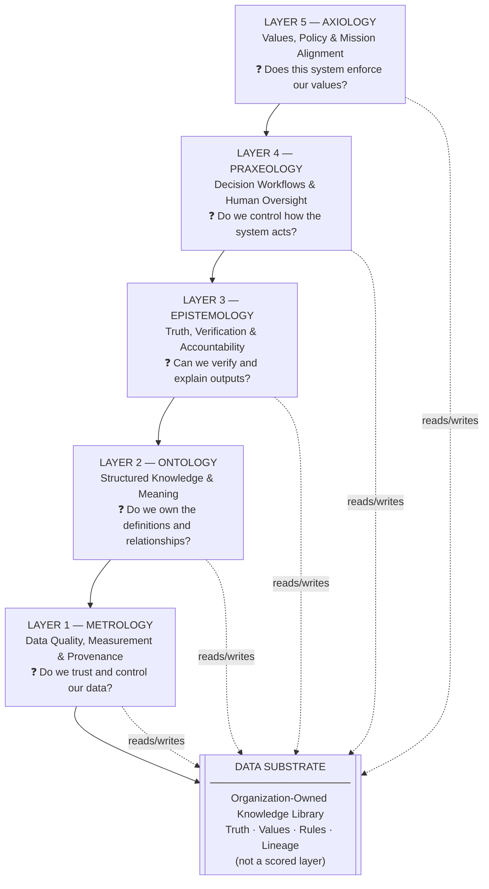

# Philosophical AI Architecture

*Decode Intelligence into governable software — for enterprise and public sector leaders*

> **Own the brain. Rent the muscles.** The industry obsesses over the Artificial (compute, LLMs, infrastructure) and treats Intelligence as a black box. We open the black box.

The **Philosophical AI Architecture** is a draft reference ecosystem for building auditable, institutional brains — not vendor black boxes. It uses five philosophical disciplines — **Metrology, Ontology, Epistemology, Praxeology, and Axiology** — so leaders can describe the business outcomes AI must deliver (trusted data, shared meaning, verifiable truth, governed action, enforced values) before any technology is chosen.

This repository is theory-first documentation for leaders who set direction, approve investments, and govern AI — not a production implementation. Technical stack detail lives in [ARCHITECTURE.md](ARCHITECTURE.md) for architects and builders.

> **Business first.** MOEPA names what the organization must own. Tool choices come second. See [pitch strategy](docs/pitch-strategy.md) §0.

---

## Naming

Never conflate the overarching system with the operational tool.

| Term | What it is | Where to find it |
|---|---|---|
| **Philosophical AI Architecture** | The full ecosystem: Data Substrate, Catalog, guardrails, own-vs-rent strategy, cognitive control plane | This README, [pitch strategy](docs/pitch-strategy.md), [glossary](docs/glossary.md) |
| **MOEPA 5-Layer Framework** | The engineering blueprint and governance engine inside the architecture: five layers, intake scoring, GO / CONDITIONAL GO / NO-GO | [5-Layer Framework for Leaders](docs/MOEPA-5-Layer-Framework.md), [Evaluation Checklist](docs/5-Layer-Evaluation-Checklist.md) |
| **MOEPA Cognitive Architecture** | The technical stack specification: storage mapping, tools, implementation playbook | [ARCHITECTURE.md](ARCHITECTURE.md) |

See [docs/pitch-strategy.md](docs/pitch-strategy.md) for audience-specific pitching guidance (enterprise leaders, public sector executives, and technical teams).

---

## The Core Mindset

**The blind spot:** Vendors sell compelling demos. Technical teams drive procurement. Intelligence stays locked inside platforms nobody can audit.

**Our move:** Decode Intelligence by mapping three cognitive functions into software:

| Function | Role | MOEPA layers |
|---|---|---|
| **Cognition** (knowing) | Define and verify reality | Metrology, Ontology, Epistemology |
| **Affect** (valuing) | Encode what matters and what is forbidden | Axiology |
| **Conation** (acting) | Execute decisions under human oversight | Praxeology |

- **Philosophy** is the operating system — strict rules for reality and truth (Metrology, Ontology, Epistemology).
- **Psychology** is the mechanics of behavior — values and execution drives (Axiology, Praxeology).

**The mission:** Build auditable, institutional brains. Rent commodity compute. Own the truth, the values, and the rules.

---

## Who This Is For

- **Enterprise executives and CXOs** — evaluating AI investment proposals and vendor dependency risk
- **Public sector leaders** (federal, state, local) — cognitive control plane for mission-critical accountability
- **Technical architects and engineers** — engineering blueprint for the Intelligence layer
- **Policy and compliance officers** — accountability, auditability, data sovereignty
- **Regulated industries** (healthcare, finance, critical infrastructure) — where decisions must be explainable to auditors and stakeholders

---

## The MOEPA 5-Layer Framework at a Glance

The five layers are the engineering blueprint inside the Philosophical AI Architecture. Each layer answers a distinct question a leader must be able to defend.



| Layer | Philosophical discipline | Business outcome leaders must own | Core leadership question |
|---|---|---|---|
| **Metrology** | Measurement | Trusted, auditable data foundation | Do we control and trust the data? |
| **Ontology** | Structure of reality | Shared definitions and relationships | Do we own the meaning of our domain? |
| **Epistemology** | Knowledge and truth | Verifiable conclusions with evidence | Can we explain and defend every output? |
| **Praxeology** | Purposeful action | Governed workflows with human oversight | Do we control how the system acts? |
| **Axiology** | Values and ethics | Mission alignment and enforced constraints | Does this system enforce our values? |

*For engineering translation (graphs, workflows, guardrails, storage), see [MOEPA 5-Layer Framework](docs/MOEPA-5-Layer-Framework.md) and [ARCHITECTURE.md](ARCHITECTURE.md).*

**The Data Substrate** is the organization-owned knowledge library — truth, values, rules, and lineage in one place that all five layers read from and write to. **The MOEPA Catalog** is how leadership proves what the institution already owns and what new projects must enrich. See [Data Substrate Concept](docs/Data-Substrate-Concept.md) for the business design; technical end-state detail is in [ARCHITECTURE.md](ARCHITECTURE.md) §5.1.

---

## Own vs. Rent: The Strategic Choice

| What to **Own** (permanently) | What to **Rent** (commodity) |
|---|---|
| Data Substrate — truth, values, rules, lineage | Raw compute and GPU capacity |
| Knowledge graphs and entity definitions (Ontology) | Commercial LLM API access |
| Verification standards and audit trails (Epistemology) | Cloud storage infrastructure |
| Decision workflows and oversight gates (Praxeology) | SaaS tooling with clear exit paths |
| Guardrails and compliance policies (Axiology) | Pre-trained model weights |

> **Core takeaway:** Own the Data Substrate. Rent the LLMs. Black-box vendor solutions that cannot map to all five layers fail intake by design.

---

## Practical Use Cases

The Philosophical AI Architecture applies to any organization that must defend AI decisions to stakeholders, auditors, or regulators.

**Enterprise and commercial:**
- **Loan and credit underwriting** — Can you explain a risk score to a customer or compliance reviewer?
- **AI project intake scoring** — Does every proposal prove catalog enrichment across all five layers?
- **Customer service automation** — Can an agent audit exactly why the AI escalated or denied a request?
- **Fraud and risk detection** — Are scores based on your data and definitions, or the vendor's?

**Public sector and regulated programs:**
- **Third-party income verification** (benefits and compliance programs) — Can your system explain a confidence score of 98% to a constituent or auditor?
- **Benefits eligibility determination** — Can a caseworker audit exactly why the AI recommended denial?
- **Procurement and oversight review** — Can leadership produce a complete decision record without vendor mediation?

Detailed walkthroughs: [examples/](examples/)

---

## How to Use This Repository

**Leaders and executives (start here):**
1. [Pitch Strategy](docs/pitch-strategy.md) — business-first narrative and audience rules
2. [Business Leader Guide](docs/moepa-business-leaders-guide.md) — ownership and intake for any organization *(start here for enterprise)*
3. [Public Sector Leader Guide](docs/moepa-public-sector-leaders-guide.md) — accountability framing for government and public institutions *(federal, state, local)*
4. [MOEPA 5-Layer Framework for Leaders](docs/MOEPA-5-Layer-Framework.md) — one business question per layer
5. [5-Layer Evaluation Checklist](docs/5-Layer-Evaluation-Checklist.md) — GO / CONDITIONAL GO / NO-GO scoring
6. [Own vs. Rented AI Strategy](docs/Owned-vs-Rented-AI-Strategy.md) — what to own vs. rent
7. [Examples](examples/) — scenario walkthroughs (public-sector scenarios; principles apply broadly)

**Technical architects / engineers (after the business case is clear):**
1. [ARCHITECTURE.md](ARCHITECTURE.md) — MOEPA Cognitive Architecture technical spec
2. [Architectural Governance and Evolution Guidelines](docs/MOEPA-Architectural-Governance-and-Evolution-Guidelines.md) — implementation evolution rules
3. [Data Substrate Concept](docs/Data-Substrate-Concept.md) — knowledge library design
4. [Catalog](catalog/README.md) — capabilities, tools, patterns, scoring by layer

**Presenting the architecture:**
- [Pitch Strategy](docs/pitch-strategy.md) — audience hooks, terminology, tone rules

---

## Repository Structure

```
README.md                          ← Start here
ARCHITECTURE.md                    ← MOEPA Cognitive Architecture (technical spec)
│
├── docs/
│   ├── pitch-strategy.md                  ← Canonical pitch directive
│   ├── MOEPA-5-Layer-Framework.md         ← Business questions per layer
│   ├── Data-Substrate-Concept.md          ← Organization-owned knowledge library
│   ├── Owned-vs-Rented-AI-Strategy.md     ← Own substrate, rent compute
│   ├── 5-Layer-Evaluation-Checklist.md    ← Intake scoring rubric
│   ├── MOEPA-Architectural-Governance-and-Evolution-Guidelines.md ← MCP-first evolution rules
│   ├── moepa-business-leaders-guide.md    ← Executive handout (all organizations)
│   ├── moepa-public-sector-leaders-guide.md ← Public sector companion (federal, state, local)
│   ├── business-value.md                  ← Investment case
│   ├── faq.md                             ← Common questions
│   ├── glossary.md                        ← Term definitions
│   └── layer-diagram.md                   ← Stack diagram
│
├── catalog/                               ← MOEPA Catalog (capabilities, tools, scoring)
├── diagrams/                              ← Architecture diagrams
└── examples/                              ← Scenario walkthroughs (public-sector scenarios)
```

---

## Key Documents

| Document | Audience | Purpose |
|---|---|---|
| [Pitch Strategy](docs/pitch-strategy.md) | All communicators | Business-first narrative, audience rules, terminology |
| [Business Leader Guide](docs/moepa-business-leaders-guide.md) | Executives (all organizations) | Business outcomes per MOEPA layer |
| [Public Sector Leader Guide](docs/moepa-public-sector-leaders-guide.md) | Government executives | Cognitive control plane, oversight accountability |
| [5-Layer Framework for Leaders](docs/MOEPA-5-Layer-Framework.md) | Leaders | One business question per layer |
| [Architectural Governance and Evolution Guidelines](docs/MOEPA-Architectural-Governance-and-Evolution-Guidelines.md) | Architects + contributors | Implementation evolution rules (not executive-facing) |
| [Evaluation Checklist](docs/5-Layer-Evaluation-Checklist.md) | Program managers | Intake scoring GO / CONDITIONAL / NO-GO |
| [Own vs. Rent Strategy](docs/Owned-vs-Rented-AI-Strategy.md) | CXOs, procurement | Own substrate, rent LLMs and compute |
| [Data Substrate Concept](docs/Data-Substrate-Concept.md) | Architects | Organization-owned knowledge library |
| [Catalog](catalog/README.md) | Leaders + technical teams | MOEPA Catalog — capabilities, deduplication, scoring |
| [Glossary](docs/glossary.md) | All readers | Philosophical AI Architecture term hierarchy |
| [MOEPA Cognitive Architecture Spec](ARCHITECTURE.md) | Architects / CTO | Technical stack and implementation playbook |

---

## Feedback and Contributions

Open-source reference for the Philosophical AI Architecture. Feedback welcome via **issues only** — the maintainer implements accepted changes on `main`.

- **Suggest improvements:** open a [Feedback issue](https://github.com/PhilipAsiala/philosophical-ai-architecture/issues/new?template=feedback.yml) or [Proposal / RFC](https://github.com/PhilipAsiala/philosophical-ai-architecture/issues/new?template=proposal-rfc.yml) — do not open pull requests
- **Adapt for your organization:** MIT-licensed — fork and modify freely for your own use
- **Contribution policy:** [CONTRIBUTING.md](CONTRIBUTING.md)

> Theory and documentation only. No production code or working agents.

---

*Philosophical AI Architecture · MOEPA 5-Layer Framework v2.3 · June 2026 · MIT License*