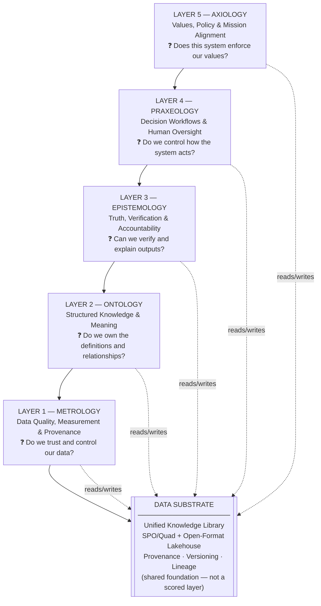

# MOEPA: A Philosophical AI Architecture for Government Leaders

> **Own your AI knowledge and decision-making — instead of renting black-box solutions from vendors.**

A strategic AI governance framework for government and enterprise leaders, built around five cognitive layers — **Metrology, Ontology, Epistemology, Praxeology, and Axiology** — and a unified **Data Substrate** that ties them together.

This repository is a theory-first reference for leaders who set direction, approve investments, and govern AI — not a technical implementation guide.

---

## The Core Problem

Government agencies are under pressure to adopt AI quickly. Vendors offer compelling demos, and technical teams often drive procurement. But this creates a dangerous pattern:

- **Institutional knowledge stays inside vendor platforms** — when the contract ends, so does your capability.
- **Decisions become unexplainable** — black-box outputs cannot be audited or defended to oversight bodies.
- **Values drift silently** — systems optimized for vendor metrics may not align to your agency's mission.
- **Costs compound** — each new vendor adds another dependency, another integration, another renewal negotiation.

The alternative is an **owned-brain strategy**: rent commodity compute (servers, GPUs), but own the intellectual layer — your data definitions, your verification standards, your decision logic, your values.

MOEPA is the framework for doing that.

---

## Who This Is For

This repository is designed for:

- **Agency leaders and CXOs** evaluating AI investment proposals
- **Government program managers** overseeing AI projects and procurement
- **Policy and compliance officers** assessing risk and accountability
- **IRS, Treasury, and similar agencies** where data integrity and auditability are mission-critical
- **Technical architects** who need a governance framework to anchor their designs

You do not need a technical background to use this repository. The framework is expressed in leadership and governance terms first.

---

## The MOEPA Framework at a Glance

MOEPA organizes AI capability into five interdependent layers, each corresponding to a distinct question a leader should be able to answer about any AI system they oversee.



| Layer | What It Governs | Core Leadership Question | Red Flag |
|---|---|---|---|
| **Metrology** | Data quality, measurement, provenance | Do we control and trust the data this system uses? | Vendor-owned data pipelines, hidden lineage |
| **Ontology** | Structured knowledge, entities, relationships | Do we own the meaning and definitions in our data? | Inconsistent terms, vendor-controlled semantics |
| **Epistemology** | Truth verification, fact vs. inference | Can we verify outputs and trace decisions to sources? | Black-box answers, unauditable recommendations |
| **Praxeology** | Decision workflows, human oversight | Do we control how the system acts and who approves? | Autonomous actions without human checkpoints |
| **Axiology** | Values, ethics, compliance, mission alignment | Does this system enforce our values and can we prove it? | Mission drift, policy bypass, untestable guardrails |

**The Data Substrate** (not a scored layer) is the shared knowledge library that all five layers read from and write to. It holds your organization's facts, relationships, decisions, and provenance records in open, portable formats you own.

---

## Own vs. Rent: The Strategic Choice

| What to **Own** | What to **Rent** |
|---|---|
| Data quality rules and lineage (Metrology) | Raw compute and GPU capacity |
| Knowledge graph and entity definitions (Ontology) | Pre-trained language model weights |
| Verification standards and audit trails (Epistemology) | Cloud storage infrastructure |
| Decision workflow logic and human oversight gates (Praxeology) | SaaS tooling without lock-in risk |
| Values, guardrails, and compliance policies (Axiology) | Commodity APIs with clear exit paths |

> **Leader takeaway:** If a vendor owns your data definitions, your truth standards, or your decision logic, you are not buying AI capability — you are renting it indefinitely, with increasing switching costs.

---

## Practical Government Use Cases

This framework applies directly to high-stakes government workflows:

- **Third-party income verification** (IRS / tax compliance) — Can your system explain a confidence score of 98% to a taxpayer or auditor? Does an independent verification layer catch model errors before action is taken?
- **AI project intake scoring** — How do you consistently evaluate and prioritize incoming AI proposals across programs?
- **Benefits eligibility determination** — When the AI recommends denial, can a caseworker audit exactly why, tracing back to source data?
- **Procurement fraud detection** — Are the vendor-supplied risk scores based on your data and definitions, or theirs?

Detailed scenario walkthroughs are in the [examples/](examples/) folder.

---

## How to Use This Repository

**If you are a leader evaluating an AI proposal:**
1. Read [The 5-Layer Framework for Leaders](docs/MOEPA-5-Layer-Framework.md) — one practical question per layer
2. Use the [5-Layer Evaluation Checklist](docs/5-Layer-Evaluation-Checklist.md) to score the proposal
3. Review [Owned vs. Rented AI Strategy](docs/Owned-vs-Rented-AI-Strategy.md) for the strategic framing

**If you are a program manager or technical lead:**
1. Start with the [Quick Start Guide](docs/quick-start.md)
2. Review the [Catalog](catalog/README.md) for layer-by-layer capabilities, tools, patterns, and governance scoring
3. Reference the [Data Substrate Concept](docs/Data-Substrate-Concept.md) for the knowledge library design

**If you want the full technical specification:**
- [ARCHITECTURE.md](ARCHITECTURE.md) — the complete draft specification (v2.3)
- [Catalog](catalog/README.md) — governance scoring by layer

---

## Repository Structure

```
README.md                          ← Start here
ARCHITECTURE.md                    ← Full technical specification
│
├── docs/
│   ├── MOEPA-5-Layer-Framework.md         ← Framework overview for leaders
│   ├── Data-Substrate-Concept.md          ← Unified knowledge library explained
│   ├── Owned-vs-Rented-AI-Strategy.md     ← Side-by-side strategy comparison
│   ├── 5-Layer-Evaluation-Checklist.md    ← Scoring rubric for AI proposals
│   ├── moepa-business-leaders-guide.md    ← Executive handout
│   ├── moepa-federal-leaders-guide.md     ← Government-focused leader guide
│   ├── business-value.md                  ← Investment and value case
│   ├── faq.md                             ← Common questions answered
│   ├── glossary.md                        ← Term definitions
│   └── layer-diagram.md                   ← Detailed architecture diagram
│
├── catalog/                               ← The single MOEPA Catalog (capabilities, tools, patterns, scoring, cross-layer compositions)
│   ├── README.md
│   ├── capability-matrix.md
│   ├── cross-layer-compositions.md
│   └── [layer folders with capabilities, scoring, tools, patterns]
│
├── diagrams/
│   ├── moepa-stack.md                     ← Full stack diagram with Data Substrate
│   ├── information-flow.md                ← How information moves across layers
│   └── owned-vs-rented.md                 ← Own vs. rent visual comparison
│
├── examples/
│   ├── income-verification.md             ← Third-party income verification scenario
│   ├── project-intake-scoring.md          ← AI project evaluation scenario
│   └── benefits-eligibility.md            ← Benefits determination scenario
│
└── catalog/                               ← Governance scoring catalog (detailed)
    ├── README.md
    ├── capability-matrix.md
    └── [layer folders with scoring rubrics]
```

---

## Key Documents

| Document | Audience | Purpose |
|---|---|---|
| [5-Layer Framework for Leaders](docs/MOEPA-5-Layer-Framework.md) | Agency leaders | Practical per-layer questions |
| [Evaluation Checklist](docs/5-Layer-Evaluation-Checklist.md) | Program managers | Score AI proposals GO / CONDITIONAL / NO-GO |
| [Own vs. Rent Strategy](docs/Owned-vs-Rented-AI-Strategy.md) | CXOs, procurement | Strategic investment framing |
| [Data Substrate Concept](docs/Data-Substrate-Concept.md) | Technical architects | Knowledge library design |
| [Business Leader Guide](docs/moepa-business-leaders-guide.md) | Executives | Full executive handout |
| [Federal Leader Guide](docs/moepa-federal-leaders-guide.md) | Government leaders | Agency-specific guidance |
| [Catalog](catalog/README.md) | Leaders + technical teams | Capabilities, tools, patterns, scoring, and cross-layer governance reference |
| [Full Architecture Spec](ARCHITECTURE.md) | Architects / CTO | Complete technical specification |

---

## Feedback and Contributions

This is an open-source reference framework. Feedback, corrections, and contributions are welcome.

- **To suggest improvements:** open an issue or pull request
- **To adapt this for your agency:** the framework is MIT-licensed — use and modify freely
- **To discuss the strategy:** see [CONTRIBUTING.md](CONTRIBUTING.md) for guidelines

> This repository is strictly theory and documentation. It does not include production code or working agents.

---

*Framework version 2.3 · Last updated June 2026 · MIT License*
