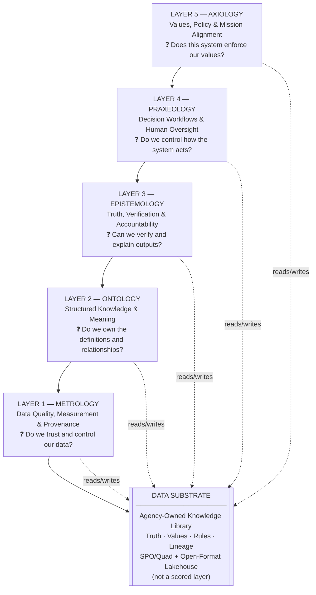

# Philosophical AI Architecture

*Decode Intelligence into governable software — for government and enterprise leaders*

> **Own the brain. Rent the muscles.** The industry obsesses over the Artificial (compute, LLMs, infrastructure) and treats Intelligence as a black box. We open the black box.

The **Philosophical AI Architecture** is a draft reference ecosystem for building auditable, institutional brains — not vendor black boxes. It maps human cognitive functions into strict, governable software, anchored by a unified **Data Substrate**, a **MOEPA Catalog**, and the **MOEPA 5-Layer Framework** as the engineering blueprint and intake control plane.

This repository is theory-first documentation for leaders who set direction, approve investments, and govern AI — not a production implementation.

---

## Naming

Never conflate the overarching system with the operational tool.

| Term | What it is | Where to find it |
|---|---|---|
| **Philosophical AI Architecture** | The full ecosystem: Data Substrate, Catalog, guardrails, own-vs-rent strategy, cognitive control plane | This README, [pitch strategy](docs/pitch-strategy.md), [glossary](docs/glossary.md) |
| **MOEPA 5-Layer Framework** | The engineering blueprint and governance engine inside the architecture: five layers, intake scoring, GO / CONDITIONAL GO / NO-GO | [5-Layer Framework for Leaders](docs/MOEPA-5-Layer-Framework.md), [Evaluation Checklist](docs/5-Layer-Evaluation-Checklist.md) |
| **MOEPA Cognitive Architecture** | The technical stack specification: storage mapping, tools, implementation playbook | [ARCHITECTURE.md](ARCHITECTURE.md) |

See [docs/pitch-strategy.md](docs/pitch-strategy.md) for audience-specific pitching guidance (technical teams vs. federal leadership).

---

## The Core Mindset

**The blind spot:** Vendors sell compelling demos. Technical teams drive procurement. Intelligence stays locked inside platforms nobody can audit.

**Our move:** Decode Intelligence by mapping three cognitive functions into software:

| Function | Role | MOEPA layers |
|---|---|---|
| **Cognition** (knowing) | Define and verify reality | Metrology, Ontology, Epistemology |
| **Affect** (valuing) | Encode what matters and what is forbidden | Axiology |
| **Conation** (acting) | Execute decisions under human oversight | Praxeology |

- **Philosophy** is the operating system — strict rules for reality and truth (Metrology, Ontology, Epistemology).
- **Psychology** is the mechanics of behavior — values and execution drives (Axiology, Praxeology).

**The mission:** Build auditable, institutional brains. Rent commodity compute. Own the truth, the values, and the rules.

---

## Who This Is For

- **Federal executives and acquisition officers** — cognitive control plane, not IT metrics alone
- **Agency leaders and CXOs** — evaluating AI investment proposals
- **Technical architects and engineers** — engineering blueprint for the Intelligence layer
- **Policy and compliance officers** — accountability, auditability, data sovereignty
- **IRS, Treasury, and similar agencies** — where data integrity is mission-critical

---

## The MOEPA 5-Layer Framework at a Glance

The five layers are the engineering blueprint inside the Philosophical AI Architecture. Each layer answers a distinct question a leader must be able to defend.



| Layer | Engineering translation | Core leadership question | Red flag |
|---|---|---|---|
| **Metrology** | Telemetry, audit trails, performance scoring | Do we control and trust the data? | Vendor-owned pipelines, hidden lineage |
| **Ontology** | Knowledge graphs, approved vocabularies, data models | Do we own the definitions and relationships? | Vendor-controlled semantics |
| **Epistemology** | RAG validation, evidence mapping, source indexing | Can we verify outputs and trace decisions? | Black-box answers |
| **Praxeology** | Digitized SOPs, workflows, agentic playbooks | Do we control how the system acts? | Autonomous actions without checkpoints |
| **Axiology** | Guardrails, access controls, NIST-aligned compliance | Does this system enforce our values? | Mission drift, untestable guardrails |

**The Data Substrate** is the agency-owned knowledge library all five layers read from and write to. **The MOEPA Catalog** is the routing and governance catalog that proves what the institution already owns — and what new projects must enrich.

---

## Own vs. Rent: The Strategic Choice

| What to **Own** (permanently) | What to **Rent** (commodity) |
|---|---|
| Data Substrate — truth, values, rules, lineage | Raw compute and GPU capacity |
| Knowledge graphs and entity definitions (Ontology) | Commercial LLM API access |
| Verification standards and audit trails (Epistemology) | Cloud storage infrastructure |
| Decision workflows and oversight gates (Praxeology) | SaaS tooling with clear exit paths |
| Guardrails and compliance policies (Axiology) | Pre-trained model weights |

> **Federal takeaway:** Own the Data Substrate. Rent the LLMs. Black-box vendor solutions that cannot map to all five layers fail intake by design.

---

## Practical Government Use Cases

The Philosophical AI Architecture applies directly to high-stakes government workflows:

- **Third-party income verification** (IRS / tax compliance) — Can your system explain a confidence score of 98% to a taxpayer or auditor?
- **AI project intake scoring** — Does every proposal prove catalog enrichment across all five layers?
- **Benefits eligibility determination** — Can a caseworker audit exactly why the AI recommended denial?
- **Procurement fraud detection** — Are risk scores based on your data and definitions, or the vendor's?

Detailed walkthroughs: [examples/](examples/)

---

## How to Use This Repository

**Federal leadership / acquisition:**
1. [Federal Leader Guide](docs/moepa-federal-leaders-guide.md) — cognitive control plane and intake lever
2. [5-Layer Evaluation Checklist](docs/5-Layer-Evaluation-Checklist.md) — GO / CONDITIONAL GO / NO-GO scoring
3. [Own vs. Rented AI Strategy](docs/Owned-vs-Rented-AI-Strategy.md) — own substrate, rent compute

**Technical architects / engineers:**
1. [MOEPA 5-Layer Framework for Leaders](docs/MOEPA-5-Layer-Framework.md) — engineering blueprint
2. [Data Substrate Concept](docs/Data-Substrate-Concept.md) — knowledge library design
3. [ARCHITECTURE.md](ARCHITECTURE.md) — MOEPA Cognitive Architecture technical spec
4. [Catalog](catalog/README.md) — capabilities, tools, patterns, scoring by layer

**Presenting the architecture:**
- [Pitch Strategy](docs/pitch-strategy.md) — audience hooks, terminology, tone rules

---

## Repository Structure

```
README.md                          ← Start here
ARCHITECTURE.md                    ← MOEPA Cognitive Architecture (technical spec)
│
├── docs/
│   ├── pitch-strategy.md                  ← Canonical pitch directive
│   ├── MOEPA-5-Layer-Framework.md         ← Engineering blueprint for leaders
│   ├── Data-Substrate-Concept.md          ← Agency-owned knowledge library
│   ├── Owned-vs-Rented-AI-Strategy.md     ← Own substrate, rent compute
│   ├── 5-Layer-Evaluation-Checklist.md    ← Intake scoring rubric
│   ├── moepa-business-leaders-guide.md    ← Executive handout
│   ├── moepa-federal-leaders-guide.md     ← Federal cognitive control plane
│   ├── business-value.md                  ← Investment case
│   ├── faq.md                             ← Common questions
│   ├── glossary.md                        ← Term definitions
│   └── layer-diagram.md                   ← Stack diagram
│
├── catalog/                               ← MOEPA Catalog (capabilities, tools, scoring)
├── diagrams/                              ← Architecture diagrams
└── examples/                              ← Government scenario walkthroughs
```

---

## Key Documents

| Document | Audience | Purpose |
|---|---|---|
| [Pitch Strategy](docs/pitch-strategy.md) | All communicators | Canonical narrative, hooks, terminology |
| [5-Layer Framework for Leaders](docs/MOEPA-5-Layer-Framework.md) | Leaders + engineers | Engineering blueprint, per-layer questions |
| [Evaluation Checklist](docs/5-Layer-Evaluation-Checklist.md) | Program managers | Intake scoring GO / CONDITIONAL / NO-GO |
| [Federal Leader Guide](docs/moepa-federal-leaders-guide.md) | Government executives | Cognitive control plane, catalog enrichment |
| [Own vs. Rent Strategy](docs/Owned-vs-Rented-AI-Strategy.md) | CXOs, procurement | Own substrate, rent LLMs and compute |
| [Data Substrate Concept](docs/Data-Substrate-Concept.md) | Architects | Agency-owned knowledge library |
| [Catalog](catalog/README.md) | Leaders + technical teams | MOEPA Catalog — capabilities, deduplication, scoring |
| [Glossary](docs/glossary.md) | All readers | Philosophical AI Architecture term hierarchy |
| [MOEPA Cognitive Architecture Spec](ARCHITECTURE.md) | Architects / CTO | Technical stack and implementation playbook |

---

## Feedback and Contributions

Open-source reference for the Philosophical AI Architecture. Feedback welcome.

- **Suggest improvements:** open an issue or pull request
- **Adapt for your agency:** MIT-licensed — use and modify freely
- **Contribution guidelines:** [CONTRIBUTING.md](CONTRIBUTING.md)

> Theory and documentation only. No production code or working agents.

---

*Philosophical AI Architecture · MOEPA 5-Layer Framework v2.3 · June 2026 · MIT License*