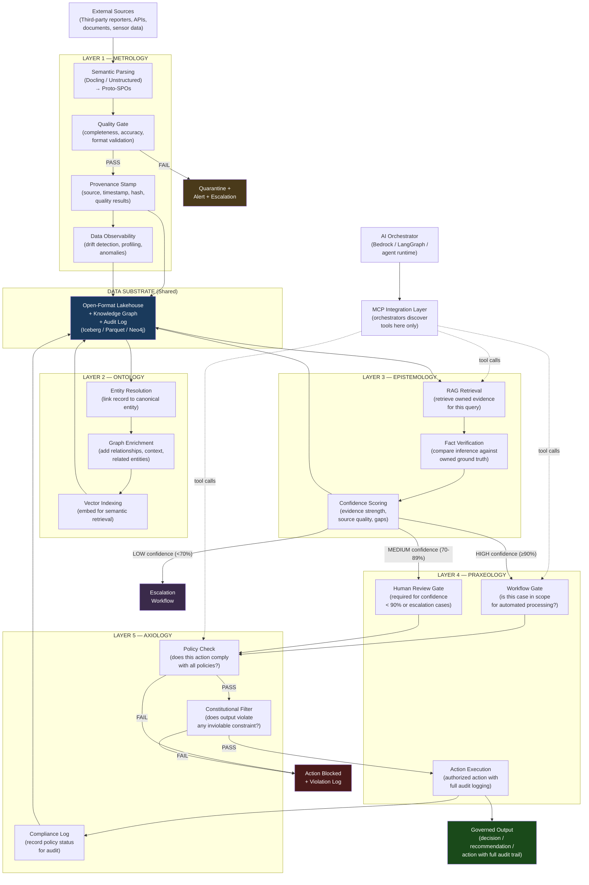

# Information Flow Across MOEPA Layers

How data, knowledge, verification, and decisions flow through the Philosophical AI Architecture — from raw source data to a governed, auditable decision on the organization-owned Data Substrate.

---

## End-to-End Information Flow

---

## Key Handoffs Between Layers

### Metrology → Data Substrate → Ontology
Every record that passes Metrology's quality gate enters the Data Substrate with a provenance stamp. Ontology then resolves the record's entity references against the canonical entity model and enriches the record with graph context.

**What passes:** Quality-validated, provenanced data records  
**What gets added:** Entity linkage, relationship context, semantic embeddings

---

### Ontology → Data Substrate → Epistemology
Ontology's enriched records and vector embeddings are stored in the Data Substrate. Epistemology retrieves them during RAG and graph-augmented verification.

**What passes:** Enriched records with entity graph context  
**What gets added:** Verification results, confidence scores, source citations

---

### Epistemology → Praxeology
Epistemology's confidence score determines how Praxeology routes the case. This is the primary gate between "knowing" and "acting."

**Routing logic:**
- ≥ 90% confidence → automated workflow eligible
- 70–89% → human review required before action
- < 70% → escalation required; no automated action

---

### Praxeology → Axiology → Output
Every proposed action passes through Axiology's policy check and constitutional filter before execution. No action bypasses this check.

**What passes:** Proposed action + full context  
**What gets added:** Policy compliance status, constitutional check result, compliance log entry

---

## What the Data Substrate Stores After Each Layer

| Layer | Records Written to Substrate |
|---|---|
| Metrology | Quality-validated records with provenance stamps and quality metrics |
| Ontology | Entity linkages, relationship graph updates, vector index entries |
| Epistemology | Verification results, confidence scores, source citations, hallucination flags |
| Praxeology | Workflow state snapshots, human approval records, audit log entries |
| Axiology | Policy check results, constitutional filter outcomes, compliance log entries |

The Data Substrate accumulates a complete, immutable record of everything the system has observed, known, decided, and done.

---

## MCP Integration Boundary

AI orchestrators (Bedrock Agents, LangGraph routers, policy-governed agent runtimes)
discover and invoke layer capabilities **only through MCP** — never by calling
data, RAG, or workflow APIs directly. Semantic ingestion, retrieval,
verification, workflow steps, and policy checks are each exposed as MCP servers
or facades. See [Architectural Governance Guidelines](../docs/MOEPA-Architectural-Governance-and-Evolution-Guidelines.md).
