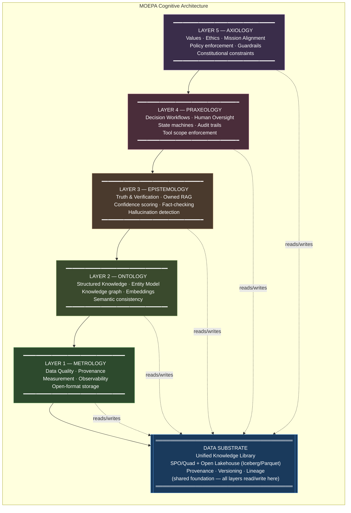

# MOEPA Stack Diagram

The MOEPA 5-Layer Framework inside the Philosophical AI Architecture, with the agency-owned Data Substrate foundation.

---

## Full Stack with Data Substrate

---

## Layer Definitions at a Glance

| Layer | Philosophical Discipline | AI Governance Role | Core Tool Examples |
|---|---|---|---|
| **5 — Axiology** | Study of value and ethics | What the system must never do; what it must preserve | Open Policy Agent, Guardrails AI, LLM Guard |
| **4 — Praxeology** | Study of purposeful action | How the system acts; who approves; what is logged | LangGraph, Temporal, Camunda, OPA |
| **3 — Epistemology** | Study of knowledge and truth | What counts as a verified fact vs. inference | LlamaIndex, Guardrails AI, RAGAS, TruLens |
| **2 — Ontology** | Study of being and relationships | What entities exist; how they relate; what terms mean | Neo4j, Apache Jena, Chroma, Qdrant |
| **1 — Metrology** | Study of measurement | What data is trusted; how quality is assured; where it came from | Great Expectations, Apache Iceberg, OpenLineage |
| **Data Substrate** | *(architectural pattern)* | Shared knowledge library; owned by the organization | Iceberg + Parquet + Neo4j + Atlas |

---

## The Governance Property of the Stack

The stack is **cumulative**: each layer builds on the reliability of the layer below it.

- If **Metrology** is weak, the entire stack is built on untrustworthy data
- If **Ontology** is weak, Epistemology cannot verify facts because the entity model is inconsistent
- If **Epistemology** is weak, Praxeology is taking action based on unverified claims
- If **Praxeology** is weak, Axiology constraints are applied to an uncontrolled execution environment
- If **Axiology** is weak, the system may optimize for the wrong objectives even while all other layers function

This is why the [5-Layer Evaluation Checklist](../docs/5-Layer-Evaluation-Checklist.md) uses the **lowest layer score** as the overall recommendation — not an average.
