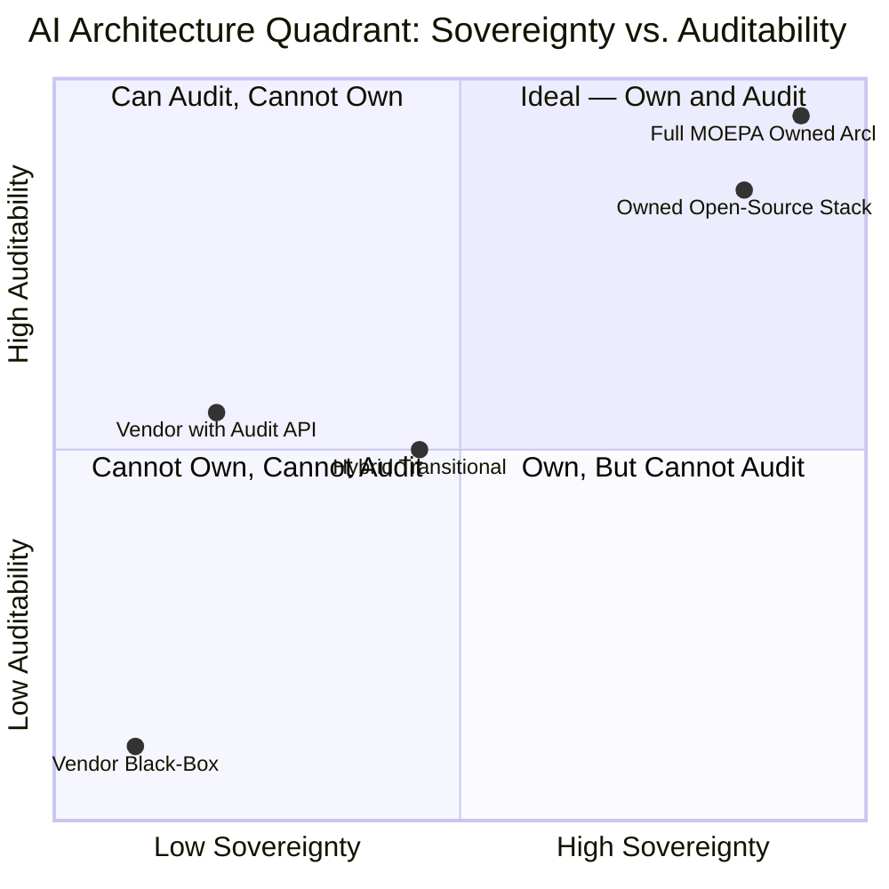
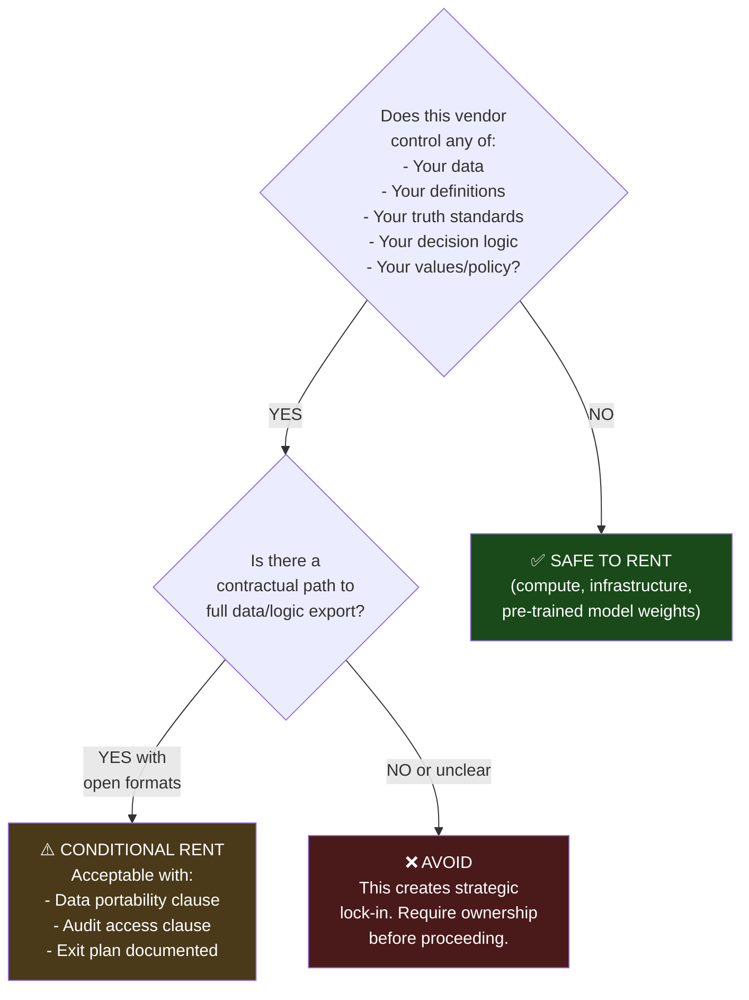

# Owned vs. Rented AI: A Visual Comparison

A side-by-side architectural comparison of rented (vendor-dependent) vs. owned (sovereign) AI approaches across the MOEPA layers.

---

## The Two Architectures

```mermaid
graph LR
    subgraph RENT["❌ RENTED ARCHITECTURE\n(Vendor Dependency)"]
        direction TB
        R5["Axiology\nVendor guardrails\nNot inspectable\nCannot be verified"]
        R4["Praxeology\nVendor workflow engine\nAudit access limited\nBlack-box logic"]
        R3["Epistemology\nVendor confidence scores\nNo independent verification\nSource citations unavailable"]
        R2["Ontology\nVendor entity model\nDefinitions not owned\nCannot be exported"]
        R1["Metrology\nVendor data platform\nLineage controlled by vendor\nLock-in risk"]
        RDS[("Vendor Data Platform\nYour data in their systems\nExport may be limited\nAccess subject to contract")]
        R5 --- R4 --- R3 --- R2 --- R1 --- RDS
    end

    subgraph OWN["✅ OWNED ARCHITECTURE\n(Sovereign Brain)"]
        direction TB
        O5["Axiology\nPolicy-as-code (OPA)\nOrg-defined constraints\nRegularly tested"]
        O4["Praxeology\nOwned state machine (LangGraph)\nImmutable audit log\nHuman gates enforced"]
        O3["Epistemology\nOwned RAG via MCP server\nFact verification gates\nExact citations to substrate"]
        O2["Ontology\nOwned knowledge graph (Neo4j)\nCanonical entity model\nVersion-controlled"]
        O1["Metrology\nSemantic ingestion → Proto-SPOs\nOpen-format lakehouse (Iceberg)\nFull provenance · MCP-exposed"]
        ODS[("Data Substrate\nOpen formats (Parquet/RDF)\nFull provenance + lineage\nOwned, portable, auditable")]
        O5 --- O4 --- O3 --- O2 --- O1 --- ODS
    end

    style RDS fill:#4a1a1a,color:#ffffff
    style R1 fill:#5a2a2a,color:#ffffff
    style R2 fill:#5a2a2a,color:#ffffff
    style R3 fill:#5a2a2a,color:#ffffff
    style R4 fill:#5a2a2a,color:#ffffff
    style R5 fill:#5a2a2a,color:#ffffff

    style ODS fill:#1a3a5c,color:#ffffff
    style O1 fill:#1a4a1a,color:#ffffff
    style O2 fill:#1a4a2a,color:#ffffff
    style O3 fill:#2a4a2a,color:#ffffff
    style O4 fill:#2a3a4a,color:#ffffff
    style O5 fill:#2a2a4a,color:#ffffff
```

---

## The Key Differences

---

## Layer-by-Layer Comparison Table

| Layer | Rented (Vendor) | Owned (MOEPA) | Migration Risk |
|---|---|---|---|
| **Data Substrate** | Vendor platform; export limited by contract | Open-format lakehouse (Iceberg/Parquet); fully portable | HIGH — historical data may not transfer |
| **Metrology** | Vendor manages quality rules and lineage | Organization-defined quality gates; full provenance records | HIGH — rules and history stay with vendor |
| **Ontology** | Vendor-defined entity model; schema not exportable | Organization-owned knowledge graph (Neo4j); version-controlled | HIGH — entity relationships may not transfer |
| **Epistemology** | Vendor confidence scores; no source access | Owned RAG; source-cited verification; confidence decomposed | MEDIUM — pipeline can be rebuilt with owned data |
| **Praxeology** | Vendor workflow engine; audit access limited | Owned state machine (LangGraph); immutable audit log | MEDIUM — workflow logic can be re-documented |
| **Axiology** | Vendor-provided guardrails; not inspectable | Policy-as-code (OPA); organization-defined; tested regularly | LOW — policy code is portable |
| **Compute / Models** | Rented cloud compute + API-accessed models | Rented cloud compute + open-weight models (Llama, Mistral) | LOW — compute is commodity |

---

## When Renting Is Acceptable

Not all renting creates unacceptable risk. The decision depends on what is being rented:

---

## The Long-Term Cost Curve

| Year | Rented Architecture | Owned Architecture |
|---|---|---|
| Year 1 | Low cost; fast start; vendor manages complexity | Higher up-front investment; team capability building required |
| Year 2–3 | Vendor lock-in solidifying; switching cost rising | Compounding returns; data and logic assets accumulate value |
| Year 5+ | Vendor renewal leverage gone; costs and dependency high | Full sovereignty; costs declining; portable to any infrastructure |
| Oversight event | Cannot independently respond; dependent on vendor | Full audit capability from owned records |
| Policy change | Must request vendor update; timeline uncertain | Update owned policy-as-code; deploy immediately |

---

## Summary

> **The rented architecture is faster to start and slower to own.**  
> **The owned architecture is slower to start and faster to govern.**

For any organization with statutory audit obligations, long-term data custody requirements, and accountability to stakeholders or oversight bodies — the owned architecture is not just better strategy. It is the only defensible approach.

---

## Related Documents

- [Owned vs. Rented AI Strategy](../docs/Owned-vs-Rented-AI-Strategy.md) — detailed strategic comparison with public-sector worked examples
- [5-Layer Evaluation Checklist](../docs/5-Layer-Evaluation-Checklist.md) — score any proposal on the own/rent spectrum
- [MOEPA Stack Diagram](moepa-stack.md) — full architecture diagram
