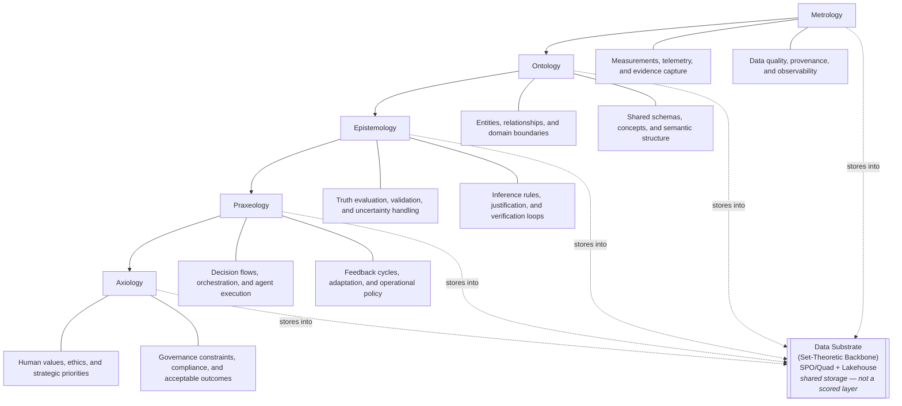

# Layered Architecture Diagram

This diagram shows the MOEPA Architecture stack as a layered flow from measurable signals and domain structure up through knowledge validation, operational action, and value governance. The **Data Substrate** (Set-Theoretic Backbone) is the shared SPO/quad + lakehouse storage medium that all five layers write to and read from; it is not a scored layer.

## Reading Guide

- **Data Substrate** is the shared SPO/quad backbone and lakehouse that all five layers store into; it is the set-theoretic representation medium and is **not** a scored layer.
- **Metrology** establishes the empirical base by defining what is measured, how signals are captured, and how evidence quality is maintained.
- **Ontology** organizes reality into usable structures, including entities, relationships, boundaries, and shared semantic models.
- **Epistemology** determines what can be treated as knowledge through validation, reasoning, traceability, and uncertainty-aware verification.
- **Praxeology** translates knowledge into action through workflows, orchestration, decision logic, and adaptive execution.
- **Axiology** governs the entire stack through values, ethics, policy constraints, and definitions of acceptable outcomes.

## Why this is layered

The stack is intentionally cumulative:

1. **Metrology** provides the measurable inputs.
2. **Ontology** gives those inputs structure and meaning.
3. **Epistemology** tests whether the resulting claims are justified.
4. **Praxeology** uses justified knowledge to drive action.
5. **Axiology** evaluates whether those actions align with human and institutional values.

## Design implication for AI architecture

In an AI system, each layer answers a different question:

- **Metrology:** What are we observing?
- **Ontology:** What does it represent?
- **Epistemology:** How do we know it is true or reliable?
- **Praxeology:** What should the system do?
- **Axiology:** What should the system never violate, and what outcomes matter most?

Taken together, the diagram is not just a conceptual ladder; it is a control architecture for building AI systems that are measurable, structured, explainable, effective, and aligned.
